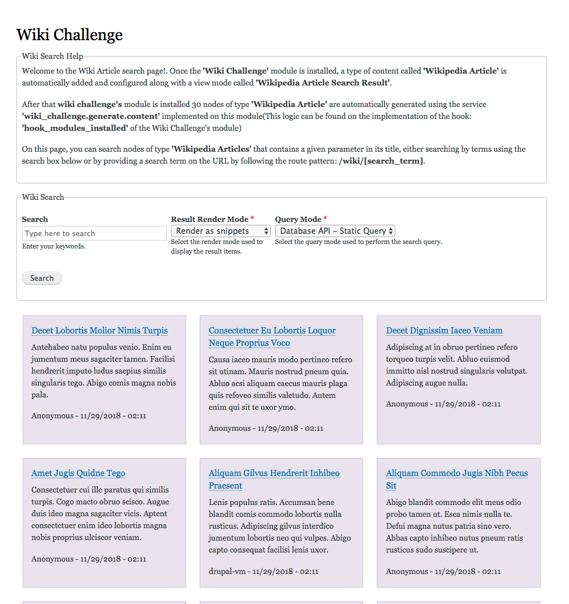
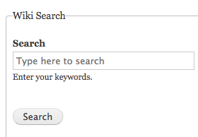
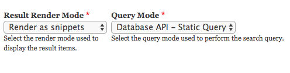
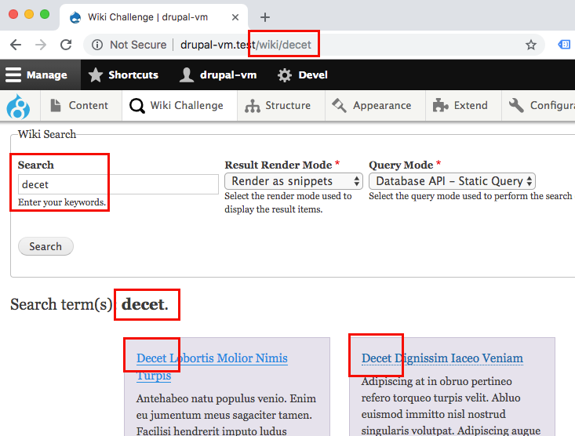
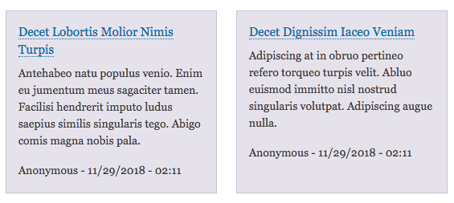

# Wiki challenge - Drupal 8 Module.
Wiki Challenge module implementation, which defines functionalities to search nodes of type 'Wikipedia Articles' that contains a given search parameter in its title, either searching by terms using the search box below or by providing a search term on the URL by following the route pattern: /wiki/[search_term].

Once the **'Wiki Challenge'** module is installed, a type of content called **'Wikipedia Article'** is automatically added and configured along with a view mode called **'Wikipedia Article Search Result'**.

After that **wiki challenge's** module is installed 30 nodes of type **'Wikipedia Article'** are automatically generated using the service `'wiki_challenge.generate.content'` implemented on this module(This logic can be found on the implementation of the hook: `'hook_modules_installed'` of the Wiki Challenge's module)

On the *Wiki search page* (`/wiki`), you can search nodes of type **'Wikipedia Articles'** that contains a given parameter in its title, either searching by terms using the search box below or by providing a search term on the URL by following the route pattern: `/wiki/[search_term]`.

Module Coding standard checked with [Coder Sniffer](https://www.drupal.org/project/coder) Version 8.2.12.

Schreenshot:



#### Wiki Challenge Documentation.

#### 1) Loads a page at /wiki which explains what this page does.
To solve this point *Wiki Challenge's* module defines a route using the path `/wiki/{parameter}` implemented by a Wiki Form class(`\Drupal\wiki_challenge\Form\WikiForm`). The definition of this route can be found in module's route config file: `wiki_challenge.routing.yml`.

#### 2) The page should include a 'Search' form field.
Since that `/wiki/{parameter}` route is being implemented by a Form Controller, the form includes an open text-input field to search by terms:



The `WikiForm` implementation has decoupled the way how is the query and the way how is info ins presented from the form implementation itself. Using [Services Tag and the Service Collector](https://www.drupal.org/docs/8/api/services-and-dependency-injection/service-tags) The form have included two select fields to set how the search query should be performed and how the result should be rendered respectively:



More details about `Query Modes` and `Render Modes` implementations in points #4 and #6 below.

#### 3) A user can either enter a value in the form field or provide a url parameter (/wiki/[parameter]).
The `WikiForm` takes the value from the Search field by default from the route parameter passed on the method buildForm on this class, if a user provides a value on the input text field of the search and submit then this takes the user to the route `/wiki/{search_tems}` being `{search_tems}` the input values provided by the users.

#### 4) If a URL parameter is provided then the page displays wikipedia articles containing the parameter in the title.
The `WikiForm` takes the search tems or parameters from the route `{search_tems}` and perform an query agains the database using the `Query Mode` selected, Currently there are two `query Mode` implementations:

  1. *Database API - Static Query* basically search by title using Static Query: 
 ```
$connection = \Drupal::database();
$query = $connection->select('node_field_data', 'a')
         ->fields('a', ['nid'])
         ->condition('title', '%' . $connection->escapeLike($keys) . '%', 'LIKE')
         ->condition('type', WIKI_CHALLENGE_WIKIPEDIA_ARTICLE_BUNDLE);
$nids = $query->execute()->fetchAllKeyed(0,0);
 ```
    Implementation: `\Drupal\wiki_challenge\QueryMode\DatabaseApiQueryMode`.
  2. *Entity API - Entity Query* basically search by title using Entity API - Entity Query:
  
    `$query = \Drupal::entityQuery('node')->condition('title', $keys, 'CONTAINS');`
    Implementation: `\Drupal\wiki_challenge\QueryMode\EntityApiQueryMode`.

#### 5) If no parameter is provided, then the page displays wikipedia articles for the term provided in the 'Search' form field.
Since that "search" form field on the `WikiForm` implementation takes the user to the route `/wiki/{search_tems}` on form submit(being `{search_tems}` the input values provided by the users) in this implementation Search form field will always get the value from the route parameter, example:



#### 6) The page should display the term that is being searched.
Once the query is resolve by the `Query Mode` class the result is passed to one of the `Render Mode` class, reducing the entity search/render process two two lines:
 ```
 // Perform the Search Query.
$entities = $query_mode->doSearch($search_term);
 // Render Wiki Articles nodes.
$items = $render_mode->doRender($entities);
```
Currently there are two `query Modes` implementations:
  1. *Render as snippets* basically render the entities using a custom theme: 
  
    `$results[] = ['#theme' => 'wiki_challenge_search_result_item', '#entity' => $entity]`
    Implementation: `\Drupal\wiki_challenge\RenderMode\RenderAsSnippetsRenderMode`.
  2. *Render as view modes* basically render the entities using a custom *view mode* and *view builder* service from *entity type Manager*:
  
    `$results[] = $this->entityTypeManager->getViewBuilder($entity->getEntityTypeId())->view($entity, $view_mode);`
    Implementation: `\Drupal\wiki_challenge\RenderMode\RenderAsViewModesRenderMode`.

#### 7) Search results should include the Title, a link to the article, and the extract for the article.
Both `Query Modes` implementations includes Title, a link to the article, and the extract for the article. For instance:



#### 8) Your module should include functional tests and relevant documentation.
Module Coding standard checked with [Coder Sniffer](https://www.drupal.org/project/coder) Version 8.2.12.

*@todo* Unit testing of the module will be include in the next release.